## Project Overview

This project is an exploratory data analysis of professional Counter-Strike 2 match results, spanning from the start of 2024 to the end of January 2026, using machine learning techniques such as XGBoost, regression, and clustering. The data was scraped from [HLTV.org](https://www.hltv.org/), the premier statistics and news website for professional Counter-Strike.

The dataset contains **3,128 rows** across **1,564 matches** involving **84 unique teams**, with 45 original columns and 13 derived features. Features include average player rating, multi-kills, ADR (average damage per round), clutch wins, trades, first kills, round streaks, and rounds won by side.

The main goal was to analyze match data to answer two questions: **what contributes to a team winning matches**, and **how many rounds a team wins their matches by**. This is important because analytics is increasingly used by professional Counter-Strike teams to develop more strategic tournament game plans. This project would allow a coach or player to identify, after a match, why the outcome was as it was. Beyond team use, esports analysts and broadcasters could leverage these findings in post-match analysis to contextualize team performance against the statistics most predictive of match outcomes.

## Data Collection

### The Problem

HLTV, while being the most comprehensive source for professional CS2 match statistics, does not store its data in JSON format. The match data is dynamically loaded using JavaScript, so using Beautiful Soup to pull the data did not get the data in the desired format. Before building an automated solution, data had to be collected manually, copying match stats tables and using cell reference formulas in Excel to get the formatting right. The StarLadder Budapest Major alone (212 rows of data) took **8 hours** to collect manually.

### The Solution

Because of the JavaScript rendering issue, Playwright had to be used. A custom web scraper was built using Playwright, which opens a Chrome browser, executes JavaScript, and interacts with dynamically loaded content with no issues. The scraper works as follows:

- Opens a tournament results page and iterates through each match
- Clicks into individual maps within a match (e.g., Vitality vs. Spirit, Map 1, Map 2, etc.), pulls the relevant stats tables, and navigates back to the match stats page
- After all maps for a match are scraped, navigates back to the tournament results page and moves to the next match
- Users can set a search range based on the total number of matches in a tournament, then run the notebook from the terminal
- After all data is pulled, the code reformats it into a more usable format, aggregating certain statistics (such as trades) while taking the maximum or minimum of others (such as kills and ADR)
- Outputs a formatted CSV that can be directly fed into the models

### Why This Matters

This scraper saved an estimated **140 hours** of manual data collection across all tournaments in the dataset. This allowed time to be spent on more valuable things, such as fine tuning models and their parameters, rather than doing data collection.

## Summary Visuals

To visualize the data, the total matches played per team were graphed as a stacked bar chart, with colors representing wins and losses. The win percentage is displayed at the top of each bar. Teams like FaZe played the most matches, but teams that played fewer matches, such as Vitality and Spirit, had much higher winning percentages. This indicates that playing more matches does not necessarily translate to more wins, as dominant teams will likely play fewer matches to advance through a group stage, and top teams may skip early tournament stages due to their world rankings.

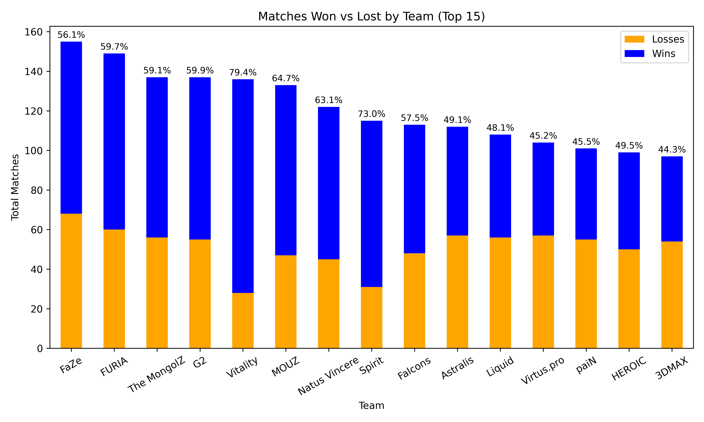

The teams with the highest and lowest ADR were also visualized. The results align with expectations: the highest ADR teams (Vitality, Spirit, MOUZ, Eternal Fire, The MongolZ) were among the most successful in 2024-2025. On the lowest end, many of these teams qualify through regional tournaments where they compete against weaker opposition, and once they reach major tournaments they face significantly better teams. However, the gap between the lowest and highest average ADR is only about 10 points, indicating that while lower-ranked teams lose more often, they remain somewhat competitive and aren't completely outclassed in every match.

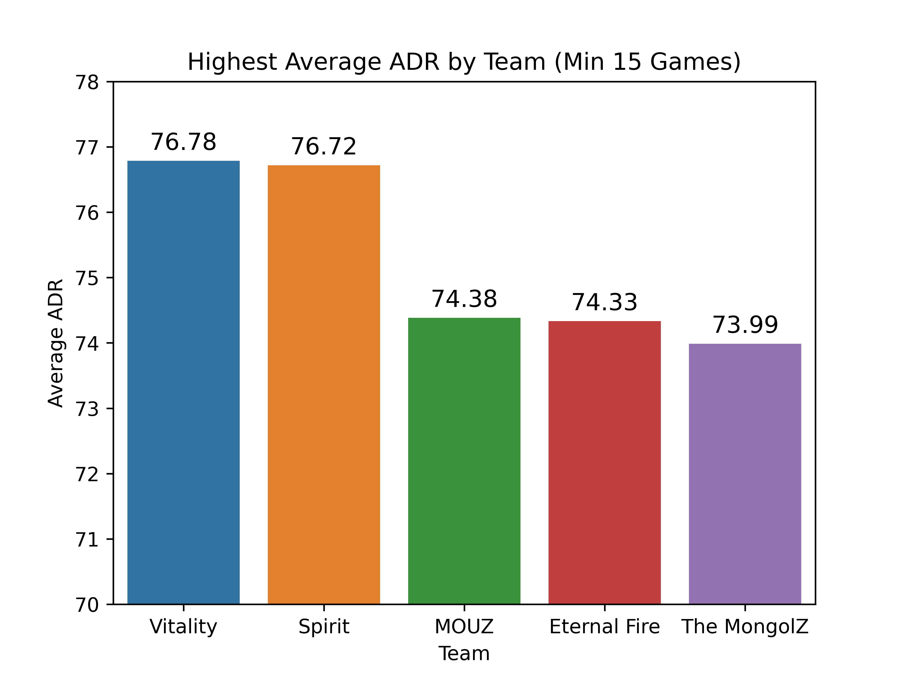

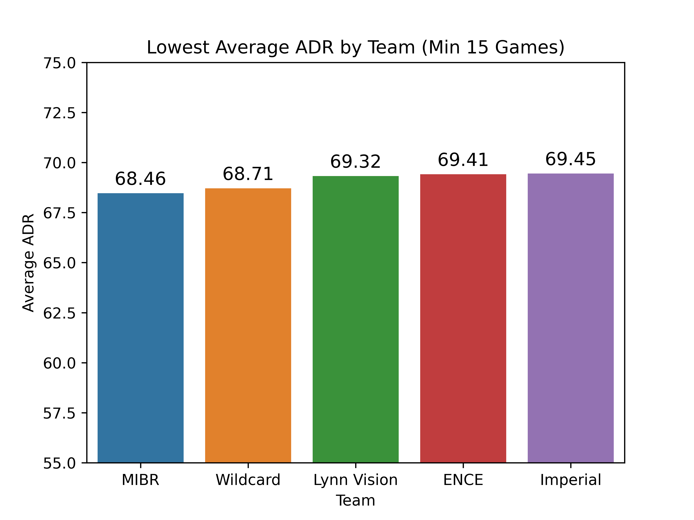

The average round differential per team was also visualized, filtered to teams with at least 15 matches. The high ADR teams such as Vitality, Spirit, and Eternal Fire have some of the highest average round differentials. Vitality's 3+ average round differential reflects their dominant 2025 season, which included 9 major tournament wins. The pattern holds on the opposite end: the lowest ADR teams also have the worst round differentials, consistently losing more rounds than they win.

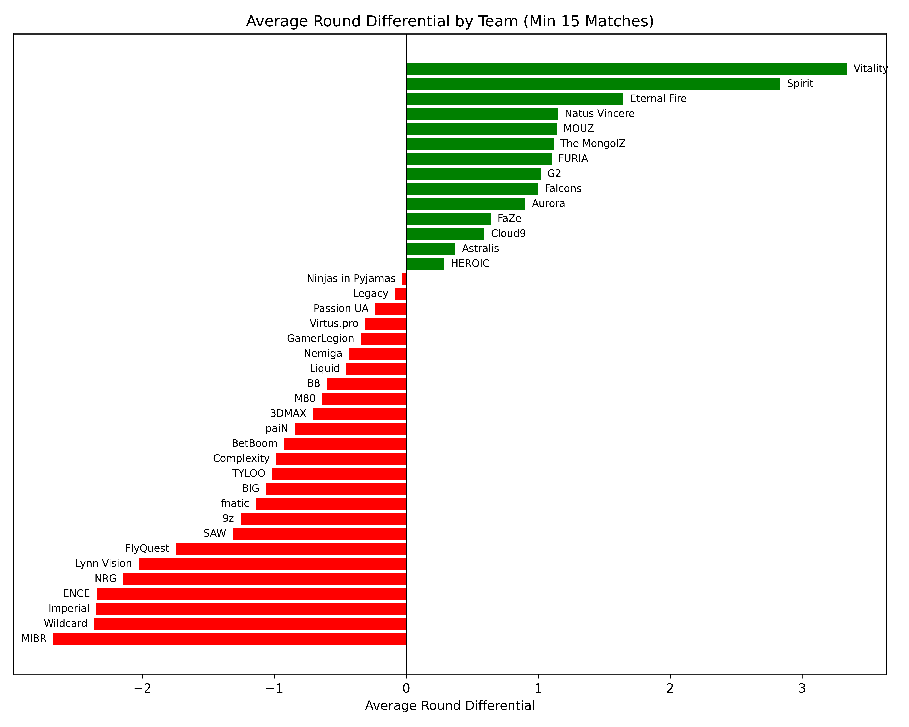

## Methods

Numerous supervised and unsupervised learning methods were applied, each to two prediction tasks: binary classification (Win) and regression (average round differential per map). Variables like total rounds were excluded from classification models since they create trivially accurate predictions: winning more rounds obviously means winning more games, which doesn't tell us anything useful.

Decision trees were first used to identify important features for both outcomes. From there, a Random Forest Regressor was implemented to capture more variation in round differential. Logistic and Linear Regression models were built using features identified as important from the decision trees, to examine the strength and direction of relationships between features and outcomes as well as to compare their pattern capturing against the tree-based models. XGBoost models were then built for both classification and regression, as XGBoost handles high-dimensional data well and includes built-in feature importance, allowing all collected features to be included without pre-selection. Manual hyperparameter tuning was performed to optimize model performance.

Lastly, clustering techniques were used to group teams based on their statistics, limited to teams that played at least 15 matches. Agglomerative hierarchical clustering was performed using both Ward and complete linkage methods, testing different numbers of clusters. K-means clustering with k = 5 and k = 3 was also applied to compare results.

## Results

### Decision Trees & Random Forest

Decision trees were first used to identify important features for both outcomes. For the round differential, the initial regression tree achieved an R² of 0.81. To capture more of the variation, a Random Forest Regressor was implemented, which increased R² to **0.89** with a Mean Absolute Error of 1.18, meaning it estimates round differential within about one round on average. The model tends to underestimate, especially in blowout games, but overall predicts expected results closely.

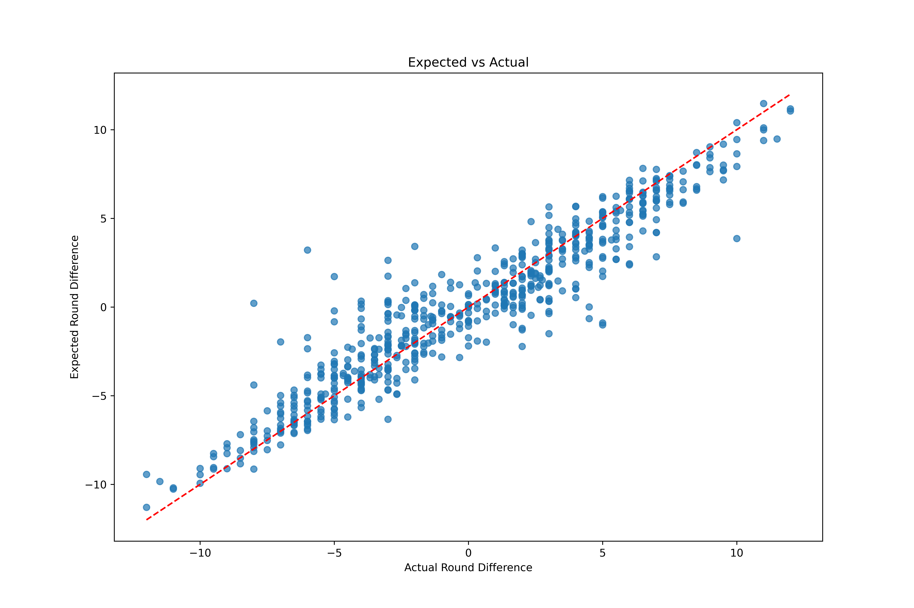

### Logistic Regression (Classification)

The Logistic Regression model used features selected from the decision tree's feature importance, including multi-kills per map, average CT rounds per map, and opponent round streaks. The model achieved **96.5% accuracy** on the test set, with T-side rounds (avg_t_round_per_map and opp_avg_t_round_per_map) emerging as the most significant predictors.

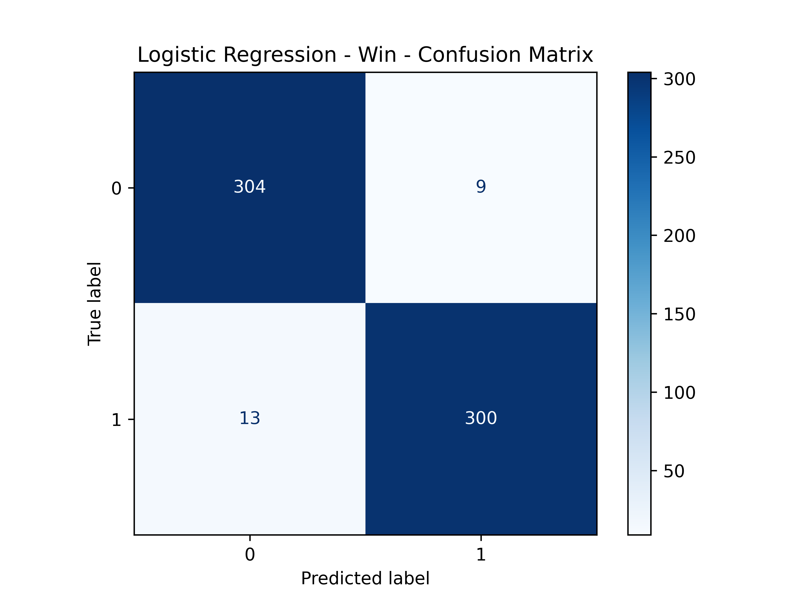

### Linear Regression (Round Differential)

The Linear Regression model achieved an R² of 0.883, similar to the RandomForestRegressor. The model identified features like 1vX_per_map and first_kills_per_map as significant. A one-unit increase in 1vX_per_map led to a 0.6457 increase in average round differential, while a one-unit increase in first_kills_per_map led to a 0.1256 increase.

### XGBoost

The XGBoost model achieved the strongest performance with an **MAE of 1.11** and an **R² of 0.915**. This is particularly impressive since Counter-Strike matches require a minimum 2-round differential to determine a winner, meaning the model predicts to within about half that margin. The model heavily weighted paired offensive and defensive stats: both your team's multi-kills and the opponent's multi-kills were the top two features, followed by round streaks for both sides and your team's highest ADR.

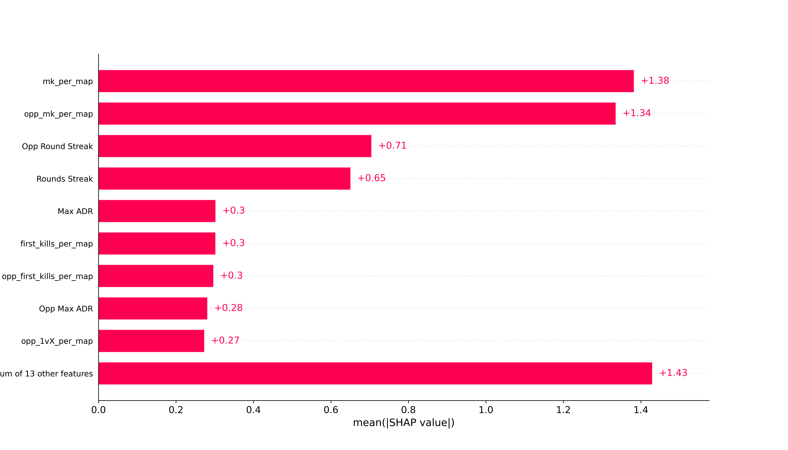

Fewer multi-kills creates a large negative impact on round differential, while the opposite is true for opponent multi-kills. Limiting opponent multi-kills corresponds to higher round differentials, positioning teams to win by larger margins.

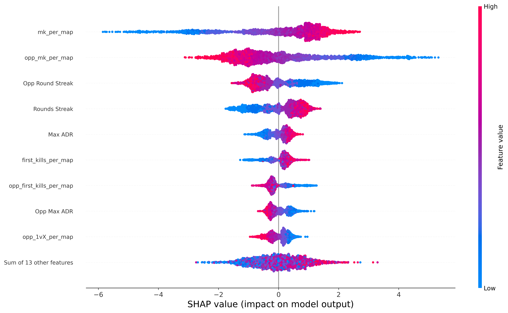

### Clustering

Clustering techniques were used to group teams based on their statistics, limited to teams with at least 15 matches.

**Hierarchical Clustering (7 clusters)** identified distinct team archetypes. One cluster contains 3 of the 5 lowest-ADR teams, while another contains the two highest win-percentage teams, Spirit and Vitality. Interestingly, the model grouped Eternal Fire and Cloud9 together, two teams that both effectively exited competitive Counter-Strike in early 2025 due to roster collapse and disbandment, suggesting the clustering captured teams in organizational decline rather than just poor performance.

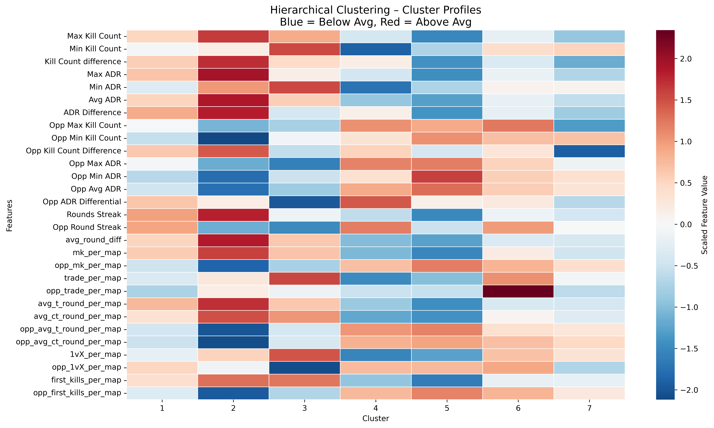

**Agglomerative Clustering (3 clusters)** consolidates teams into three clear performance tiers. Cluster 1 contains top-tier teams that regularly compete at major tournaments and rank in the top 10-15 globally. Cluster 2 captures volatile mid-tier teams that are inconsistent and can upset higher-ranked opponents on good days but usually fall short. Cluster 3 contains lower-performing teams that compete well against similarly-ranked opponents but struggle when matched against elite teams.

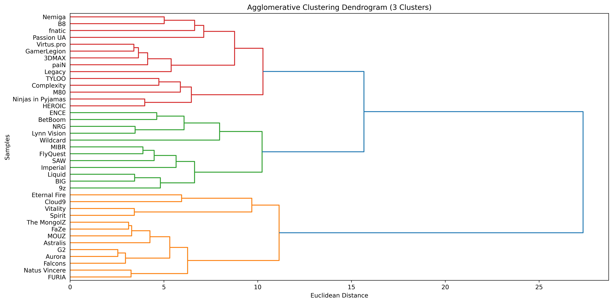

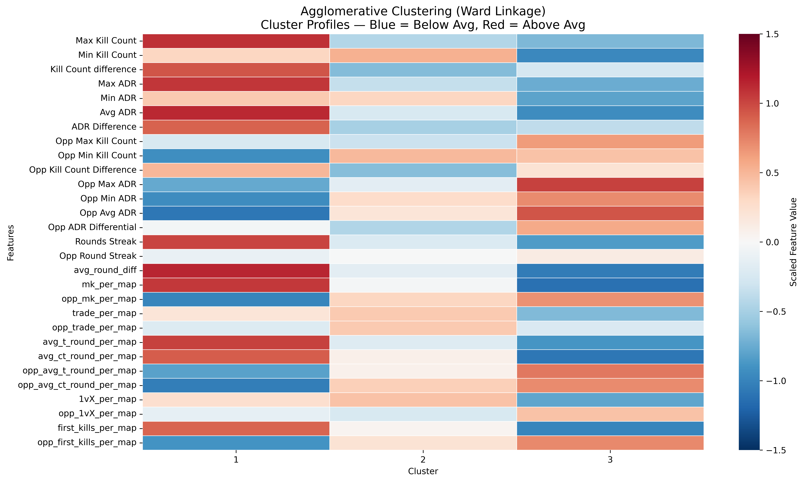

## Key Findings

**Multi-kills are the single most important predictor.** Both the XGBoost SHAP values and cluster profiles confirm that generating multi-kills while suppressing opponent multi-kills is the strongest driver of round differential. This reinforces that individual star power still matters despite Counter-Strike being a team-based game. When a team sets up their star player to get a multi-kill in one round, that player may catch fire and string together multi-kills across rounds, leading to round streaks and elevated ADR as they carry the team.

This is evident in practice with Spirit and their star player Donk. The SHAP waterfall plots below show Spirit matchups where Donk performed poorly and well, respectively. When Donk posted a 1.02 rating (well below his 2025 average of 1.42) against Falcons, nearly every feature pushed Spirit's expected round differential downward. When he posted a 1.64 rating against Natus Vincere, nearly every feature contributed positively.

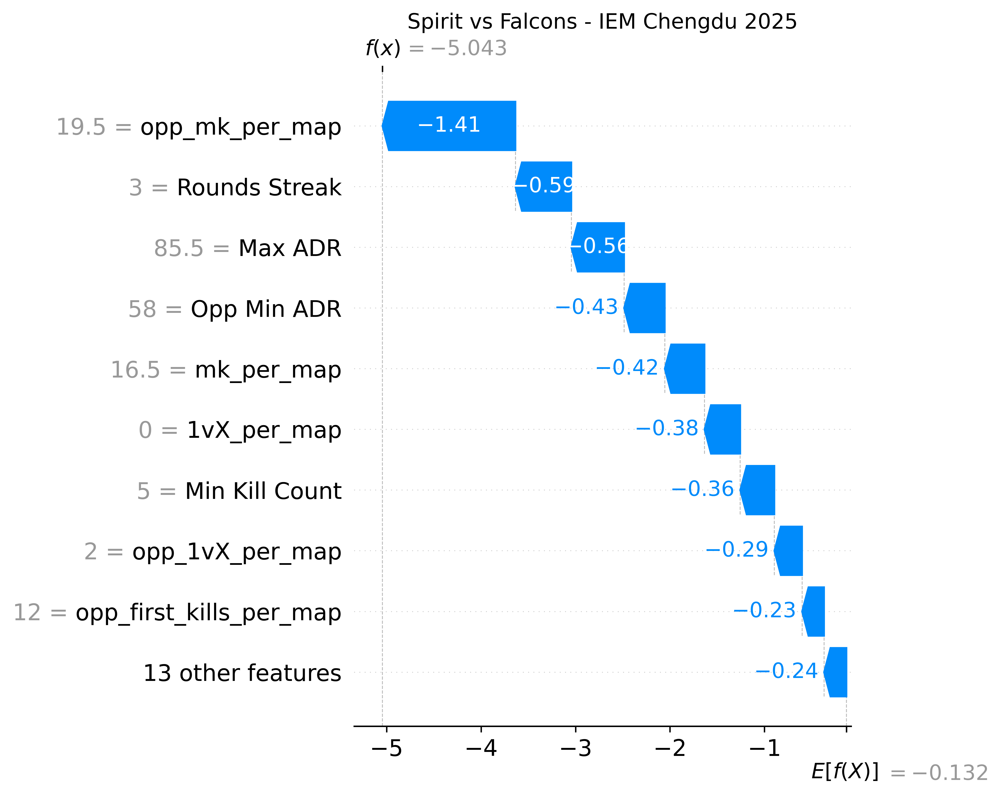

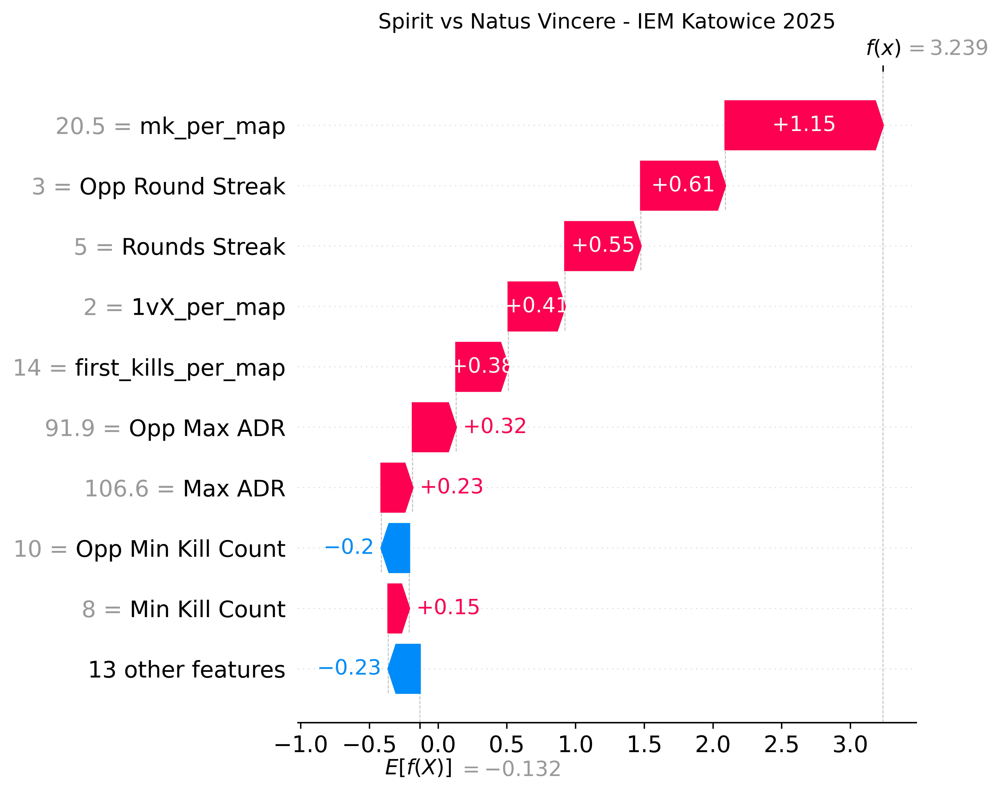

The same pattern holds for FURIA and their young star Molodoy. After signing him, FURIA's world ranking decreased slightly as the team figured out new roles, then increased sharply once Molodoy was fully integrated, catapulting them into the top 5 in the world.

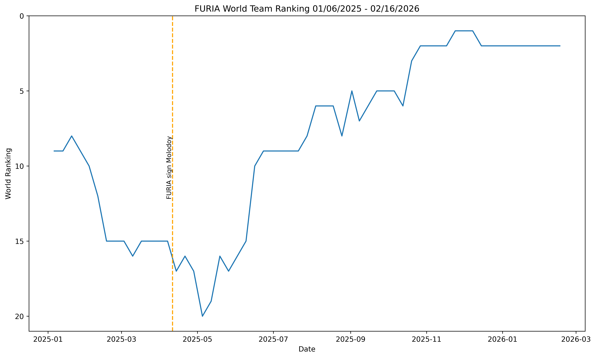

**Momentum is measurable.** The importance of Round Streaks suggests that momentum is not just psychological but creates a measurable, predictive advantage, indicating that teams should focus on breaking opponent streaks as a tactical priority.

**T-side performance is more predictive than CT-side.** The logistic regression model revealed that T-side rounds were more significant predictors of match outcomes than CT-side rounds. This suggests terrorist-side performance is more indicative of overall team strength, likely because T-side play requires more coordinated strategy and execution compared to the more reactionary nature of CT defense. Having to take space is often more difficult than sitting and holding for an enemy push.

**The star player sets the ceiling, the supporting cast sets the floor.** Clutch situations (1vX) and first kills were significant predictors in the linear regression model, highlighting the importance of both opening duels that establish numerical advantages and individual skill in high-pressure situations.

## Limitations

One limitation is the model's ability to predict blowouts. Blowouts have a unique pattern since they often have lower kill counts due to fewer rounds being played: a player will have fewer rounds to acquire kills in a 13-2 win compared to a 13-10 win. As a result, the model was slightly more conservative and struggled to predict when massive blowouts would occur. A potential solution would be adding a feature to measure the overall pace of the game or speed of round wins.

Additionally, the model does not account for external factors such as travel schedules, tournament frequency, and organizational stability. For example, a team may play a tournament in Europe, then four days later need to be in China for another tournament. Given fatigue, travel, and lack of prep, that team may underperform even if their stats suggest otherwise.

## Tools & Technologies

- **Python**: Playwright (web scraping), XGBoost, scikit-learn, SHAP, pandas, matplotlib
- **Data Source**: [HLTV.org](https://www.hltv.org/)
